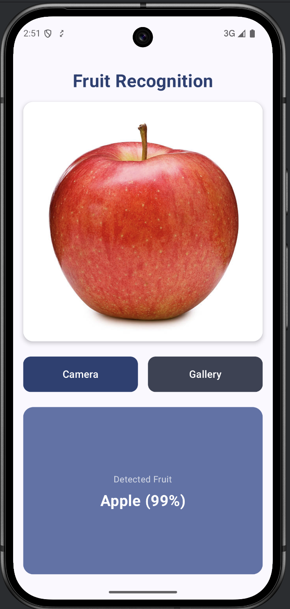
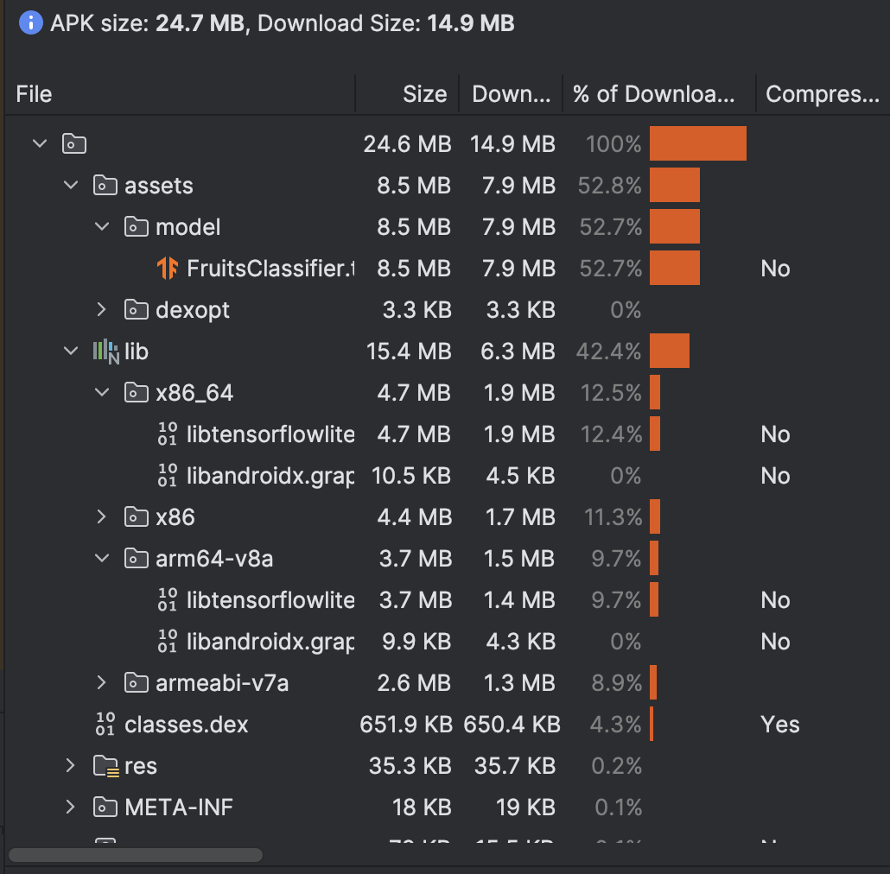

# Fruit Recognition

An Android app that uses machine learning to recognize fruits and vegetables from camera images.

## Preview



## Features

- Real-time fruit/vegetable recognition using device camera
- Supports 6 classes: Apple, Banana, Lemon, Onion, Potato, Watermelon
- On-device inference using TensorFlow Lite
- Built with Jetpack Compose

## Tech Stack

- **Language**: Kotlin
- **UI**: Jetpack Compose + Material 3
- **ML Framework**: TensorFlow Lite
- **Model Architecture**: MobileNetV2 (transfer learning)
- **Min SDK**: 24 (Android 7.0)

## Model Details

The classification model was trained using transfer learning with MobileNetV2 as the base model:

- **Input**: 150x150 RGB images
- **Output**: 6 class probabilities
- **Training accuracy**: ~97.8%
- **Dataset**: 482 images across 6 classes

See the model training notebook: [fruit_recognition_model_creation.ipynb](app/src/main/assets/model/fruit_recognition_model_creation.ipynb)

## Building

```bash
# Debug build
./gradlew assembleDebug

# Release build (minified)
./gradlew assembleRelease
```

## Project Structure

```
app/src/main/
├── java/com/iqbalansyor/fruit_ai/
│   ├── MainActivity.kt           # Entry point
│   ├── FruitRecognitionScreen.kt # Main UI with camera
│   └── FruitClassifier.kt        # TFLite model inference
└── assets/model/
    ├── FruitsClassifier.tflite   # TFLite model
    └── fruit_recognition_model_creation.ipynb  # Training notebook
```

## APK Size



## License

MIT